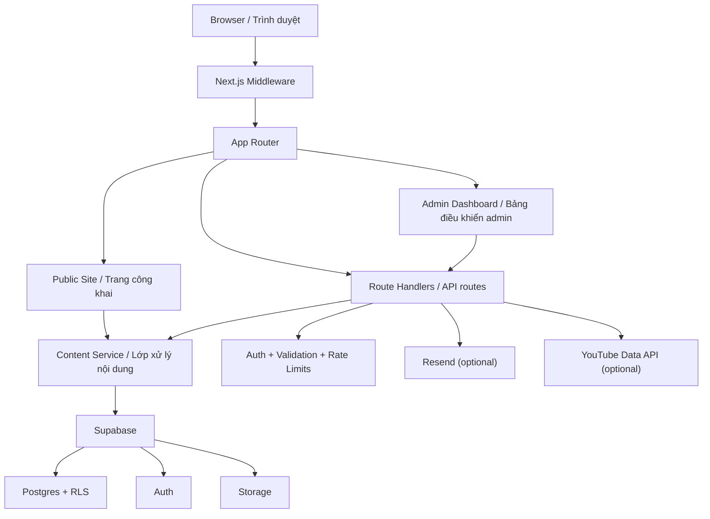

# SGM Network

Private, proprietary CMS and community platform for a Free Fire-focused audience, built with Next.js 14, TypeScript, Tailwind CSS, and Supabase.

Hệ thống CMS và nền tảng cộng đồng độc quyền dành cho tệp người dùng Free Fire, được xây dựng bằng Next.js 14, TypeScript, Tailwind CSS và Supabase.

> **English:** This repository is not open source. Access and use are limited to authorized personnel and approved partners of SGM Network. See [LICENSE](LICENSE).
>
> **Tiếng Việt:** Đây không phải là dự án mã nguồn mở. Quyền truy cập và sử dụng chỉ dành cho nhân sự được ủy quyền và đối tác đã được phê duyệt của Veltrix Media Group. Xem [LICENSE](LICENSE).

## Overview / Tổng Quan

**English:** SGM Network combines a public-facing fan/community website with a protected admin control plane. The public experience includes event timelines, news, eSports stream surfaces, gallery content, contact channels, policy pages, SEO metadata, and localized route aliases. The admin experience provides content management, role management, invitation-based onboarding, activity visibility, site settings management, and media upload support.

**Tiếng Việt:** VFuture kết hợp giữa website cộng đồng fan/public và một khu vực quản trị được bảo vệ. Phần công khai bao gồm timeline sự kiện, tin tức, khu vực eSports, gallery, kênh liên hệ, các trang chính sách, metadata SEO và các route alias đã bản địa hóa. Phần quản trị cung cấp quản lý nội dung, quản lý vai trò, quy trình mời thành viên, theo dõi hoạt động, quản lý cài đặt website và hỗ trợ tải media.

**English:** The codebase is organized around the Next.js App Router and a shared content service layer that reads from Supabase when available and falls back safely for selected read paths during local or degraded scenarios.

**Tiếng Việt:** Codebase được tổ chức xoay quanh Next.js App Router và một lớp content service dùng chung. Lớp này đọc dữ liệu từ Supabase khi sẵn sàng và có cơ chế fallback an toàn cho một số luồng đọc trong môi trường local hoặc khi backend bị suy giảm.

## Core Capabilities / Tính Năng Cốt Lõi

| English | Tiếng Việt |
| --- | --- |
| Public content pages for home, events, calendar, news, contact, privacy policy, and terms of use | Các trang công khai cho trang chủ, sự kiện, lịch, tin tức, liên hệ, chính sách bảo mật và điều khoản sử dụng |
| Parallel English and Vietnamese aliases for major public routes such as `/news` and `/tin-tuc` | Hỗ trợ alias song song cho các route công khai lớn như `/news` và `/tin-tuc` |
| Protected admin area for events, news, streams, gallery, users, logs, active admins, and settings | Khu vực admin được bảo vệ cho sự kiện, tin tức, streams, gallery, người dùng, logs, active admins và settings |
| Invitation-gated admin registration flow with Supabase Auth and optional email delivery | Quy trình đăng ký admin theo cơ chế mời trước, dùng Supabase Auth và hỗ trợ gửi email nếu cấu hình đầy đủ |
| Role-based access control with `editor`, `admin`, and `senior_admin` | Kiểm soát truy cập theo vai trò `editor`, `admin` và `senior_admin` |
| Rich text news authoring with Tiptap, category management, and slug generation | Soạn thảo tin tức rich text bằng Tiptap, quản lý danh mục và tạo slug |
| Gallery upload flow backed by Supabase Storage | Luồng tải ảnh gallery được hỗ trợ bởi Supabase Storage |
| Stream scheduling with optional YouTube API-assisted status synchronization | Lập lịch stream với khả năng đồng bộ trạng thái bằng YouTube API nếu được cấu hình |
| Contact submission endpoint with rate limiting and optional Resend delivery | Endpoint liên hệ có giới hạn tốc độ và hỗ trợ gửi mail qua Resend nếu có cấu hình |
| Security headers, request throttling, input sanitization, activity logging, and Supabase RLS policies | Header bảo mật, hạn chế request, làm sạch input, ghi log hoạt động và chính sách RLS của Supabase |

## Architecture At A Glance / Kiến Trúc Tổng Thể



## Technology Stack / Công Nghệ Sử Dụng

| Layer | English | Tiếng Việt |
| --- | --- | --- |
| Framework | Next.js 14 App Router, React 18 | Next.js 14 App Router, React 18 |
| Language | TypeScript with strict mode | TypeScript bật strict mode |
| Styling | Tailwind CSS, shadcn/ui, Base UI, custom design tokens | Tailwind CSS, shadcn/ui, Base UI và hệ biến giao diện tùy biến |
| State and data | TanStack Query, Zustand, server data loaders | TanStack Query, Zustand và các bộ nạp dữ liệu phía server |
| Backend | Next.js route handlers, Supabase SSR, Supabase service-role admin access | Route handler của Next.js, Supabase SSR và quyền admin bằng service-role |
| Database | Supabase Postgres with SQL schema and RLS policies | Supabase Postgres với schema SQL và RLS policies |
| Auth | Supabase Auth, email/password login, optional Google OAuth | Supabase Auth, đăng nhập email/password và Google OAuth nếu bật |
| Content editing | Tiptap rich text editor | Tiptap rich text editor |
| Media | Supabase Storage uploads, ImageKit-hosted brand assets | Tải media lên Supabase Storage và sử dụng brand asset trên ImageKit |
| Email | Supabase Auth invite emails and optional Resend-backed contact delivery | Email mời tài khoản qua Supabase Auth và email liên hệ qua Resend nếu cấu hình |
| Motion and UX | Framer Motion, Sonner, Lottie | Framer Motion, Sonner, Lottie |

## Repository Layout / Cấu Trúc Thư Mục

```text
.
|-- public/                  # Static assets, service worker / Tài nguyên tĩnh, service worker
|-- scripts/                 # Build and admin bootstrap scripts / Script build và khởi tạo admin
|-- src/
|   |-- app/                 # App Router pages, layouts, metadata, API routes / Trang, layout, metadata, API
|   |-- components/          # UI, layout, admin, public feature components / Component UI và tính năng
|   |-- hooks/               # React Query hooks / Hook dữ liệu
|   |-- lib/
|   |   |-- constants/       # Site config, flags, mock data / Cấu hình site, cờ, dữ liệu mẫu
|   |   |-- data/            # Shared content service layer / Lớp service nội dung dùng chung
|   |   |-- server/          # Auth, guards, rate limits, logging, stream helpers / Bảo mật và helper server
|   |   |-- supabase/        # Browser, server, admin Supabase clients / Các client Supabase
|   |   |-- types/           # Domain and database types / Kiểu dữ liệu domain và database
|   |   |-- utils/           # Utilities / Hàm tiện ích
|   |   `-- validators/      # Zod schemas / Schema xác thực dữ liệu
|   |-- store/               # Small client stores / Store nhỏ phía client
|   `-- types/               # Ambient type declarations / Khai báo type bổ sung
|-- supabase/
|   |-- schema.sql           # Database schema, triggers, policies / Schema, trigger, policy
|   `-- seed-data.sql        # Optional sample seed content / Dữ liệu mẫu tùy chọn
|-- README.md
|-- CONTRIBUTING.md
`-- LICENSE
```

## Getting Started / Bắt Đầu

### Prerequisites / Điều Kiện Tiên Quyết

| English | Tiếng Việt |
| --- | --- |
| Node.js 20 LTS or newer | Node.js 20 LTS trở lên |
| npm 10 or newer | npm 10 trở lên |
| A Supabase project with Auth, Database, and Storage enabled | Một project Supabase đã bật Auth, Database và Storage |
| A public `gallery` storage bucket if admin uploads are required | Bucket `gallery` ở chế độ public nếu cần upload từ admin |
| A Resend account if contact email delivery is required | Tài khoản Resend nếu cần gửi email liên hệ |
| A YouTube Data API key for higher-accuracy stream status detection | Khóa YouTube Data API nếu muốn nhận biết trạng thái stream chính xác hơn |
| A VAPID public key if the push subscription UI should be visible | VAPID public key nếu muốn hiện giao diện đăng ký push notification |

### 1. Install Dependencies / Cài Đặt Phụ Thuộc

```bash
npm install
```

### 2. Configure Environment Variables / Cấu Hình Biến Môi Trường

**English:** Copy `.env.example` to `.env.local`, then fill in the values for your environment.

**Tiếng Việt:** Sao chép `.env.example` thành `.env.local`, sau đó điền giá trị phù hợp với môi trường của bạn.

Only the variables below are currently read by runtime code.

Chỉ các biến dưới đây mới đang được code runtime sử dụng thực tế.

| Variable | Required | English | Tiếng Việt |
| --- | --- | --- | --- |
| `NEXT_PUBLIC_SUPABASE_URL` | Yes / Có | Supabase project URL for browser and server SSR clients | URL của project Supabase cho client browser và server SSR |
| `NEXT_PUBLIC_SUPABASE_ANON_KEY` | Yes / Có | Public Supabase anon key | Anon key công khai của Supabase |
| `SUPABASE_SERVICE_ROLE_KEY` | Yes for full admin flows / Có nếu cần đầy đủ admin | Required for admin data operations, user management, and invite workflows | Bắt buộc cho thao tác dữ liệu admin, quản lý người dùng và luồng mời tài khoản |
| `NEXT_PUBLIC_SITE_URL` | Yes / Có | Canonical site origin used for metadata and auth callbacks | Origin chuẩn của website dùng cho metadata và callback auth |
| `RESEND_API_KEY` | Optional / Tùy chọn | Enables Resend delivery for contact submissions | Bật gửi email liên hệ qua Resend |
| `ADMIN_INVITE_FROM_EMAIL` | Optional / Tùy chọn | Sender identity for Resend-backed emails | Địa chỉ người gửi cho email đi qua Resend |
| `SUPABASE_QUERY_TIMEOUT_MS` | Optional / Tùy chọn | Read timeout before the content service falls back | Thời gian timeout trước khi content service fallback |
| `DISABLE_SUPABASE_RUNTIME` | Optional / Tùy chọn | Forces selected fallback behavior; not suitable for real admin auth | Bật fallback ở một số luồng xử lý; không phù hợp cho auth admin thực tế |
| `YOUTUBE_API_KEY` | Optional / Tùy chọn | Improves stream status detection accuracy | Tăng độ chính xác khi xác định trạng thái stream |
| `NEXT_PUBLIC_VAPID_PUBLIC_KEY` | Optional / Tùy chọn | Enables the browser push subscribe button | Bật nút đăng ký push notification trên trình duyệt |

**English notes**

- `.env.example` currently includes `ADMIN_INVITE_REPLY_TO_EMAIL`, but the application does not read it at runtime.
- `NEXT_PUBLIC_VAPID_PUBLIC_KEY` only enables client-side subscription capture. Durable push delivery is not implemented in this repository.

**Ghi chú tiếng Việt**

- `.env.example` hiện có `ADMIN_INVITE_REPLY_TO_EMAIL`, nhưng ứng dụng hiện tại không đọc biến này ở runtime.
- `NEXT_PUBLIC_VAPID_PUBLIC_KEY` chỉ bật phần đăng ký subscription trên client. Cơ chế gửi push bền vững chưa được triển khai trong repository này.

### 3. Provision Supabase / Thiết Lập Supabase

1. Create a Supabase project.  
   Tạo một project Supabase.
2. Run [`supabase/schema.sql`](supabase/schema.sql) in the Supabase SQL editor.  
   Chạy [`supabase/schema.sql`](supabase/schema.sql) trong Supabase SQL editor.
3. Optionally run [`supabase/seed-data.sql`](supabase/seed-data.sql) if you want sample content.  
   Có thể chạy [`supabase/seed-data.sql`](supabase/seed-data.sql) nếu muốn nạp dữ liệu mẫu.
4. Create a public storage bucket named `gallery` if admin uploads should work out of the box.  
   Tạo bucket public tên `gallery` nếu muốn tính năng upload của admin hoạt động ngay.
5. In Supabase Auth, configure email/password auth, Google OAuth if needed, invite email template and redirect URLs including `/auth/callback`.  
   Trong Supabase Auth, cấu hình email/password, Google OAuth nếu cần, invite email template và các redirect URL bao gồm `/auth/callback`.

**Important / Quan trọng:** The bundled schema contains project-specific bootstrap assumptions for an owner account and should be reviewed before deploying to a fresh organization or tenant.  
Schema đi kèm có một số giả định khởi tạo đặc thù cho tài khoản chủ sở hữu, vì vậy cần được xem lại trước khi triển khai cho một tổ chức hoặc tenant mới.

### 4. Bootstrap An Admin Account / Khởi Tạo Tài Khoản Admin

```bash
npm run supabase:ensure-admin -- owner@example.com StrongPassword123 admin
```

**English:** The script creates or updates the Supabase Auth user, confirms the email, upserts the matching record in `public.users`, and updates the initial `social.email` setting.

**Tiếng Việt:** Script này tạo hoặc cập nhật user trong Supabase Auth, xác nhận email, upsert bản ghi tương ứng trong `public.users`, và cập nhật giá trị ban đầu của `social.email`.

**English:** Supported script roles are `editor` and `admin`. The wider application also recognizes `senior_admin`.

**Tiếng Việt:** Script hỗ trợ role `editor` và `admin`. Toàn bộ ứng dụng vẫn nhận biết thêm role `senior_admin`.

### 5. Run The Application / Chạy Ứng Dụng

```bash
npm run dev
```

| English | Tiếng Việt |
| --- | --- |
| Public site: `http://localhost:3000` | Trang công khai: `http://localhost:3000` |
| Admin login: `http://localhost:3000/auth/login` | Trang đăng nhập admin: `http://localhost:3000/auth/login` |
| Admin dashboard: `http://localhost:3000/admin` | Bảng điều khiển admin: `http://localhost:3000/admin` |

## Available Scripts / Các Script Có Sẵn

| Command | English | Tiếng Việt |
| --- | --- | --- |
| `npm run dev` | Start the local Next.js development server | Khởi động server dev Next.js |
| `npm run build` | Build for production and ensure a build ID exists | Build production và đảm bảo có BUILD_ID |
| `npm run clean:build` | Remove `.next` and rebuild from scratch | Xóa `.next` và build lại từ đầu |
| `npm run start` | Start the production server after a build | Chạy server production sau khi build |
| `npm run lint` | Run Next.js ESLint checks | Chạy kiểm tra ESLint của Next.js |
| `npm run typecheck` | Run TypeScript in no-emit mode | Chạy TypeScript ở chế độ không sinh file |
| `npm run supabase:ensure-admin -- <email> <password> [admin|editor]` | Create or update an admin-capable Supabase user | Tạo hoặc cập nhật user Supabase có quyền admin |

## Data Model And Content Flow / Mô Hình Dữ Liệu Và Luồng Nội Dung

### Primary Tables / Bảng Chính

- `public.users`
- `public.events`
- `public.news`
- `public.gallery`
- `public.settings`
- `public.admin_activity_logs`

### Settings-Backed JSON Modules / Các Module JSON Lưu Trong Settings

**English:** Not every domain object has its own table. Two notable modules are stored as settings values:

**Tiếng Việt:** Không phải đối tượng domain nào cũng có bảng riêng. Hai module đáng chú ý hiện đang được lưu dưới dạng giá trị settings:

- `security.invited_emails` for pending admin invitations  
  `security.invited_emails` để lưu danh sách email mời admin đang chờ xử lý
- `esports.streams` for stream definitions  
  `esports.streams` để lưu định nghĩa stream

**English:** This matters when designing schema changes, migrations, integrations, or reporting tooling.

**Tiếng Việt:** Điều này rất quan trọng khi thiết kế thay đổi schema, migration, tích hợp hệ thống hoặc công cụ báo cáo.

## Security Model / Mô Hình Bảo Mật

| English | Tiếng Việt |
| --- | --- |
| Middleware protects `/admin` and `/api/admin` with Supabase session checks | Middleware bảo vệ `/admin` và `/api/admin` bằng kiểm tra session Supabase |
| Route handlers add rate limiting and role-aware authorization | Route handler bổ sung rate limit và xác thực theo vai trò |
| Zod validates incoming payloads | Zod kiểm tra payload đầu vào |
| `sanitize-html` cleans plain text and rich text before persistence | `sanitize-html` làm sạch plain text và rich text trước khi lưu |
| `next.config.mjs` applies CSP, HSTS, frame, referrer, and permissions headers | `next.config.mjs` áp dụng header CSP, HSTS, frame, referrer và permissions |
| Supabase RLS policies enforce database-level access control | RLS policy của Supabase ép buộc quyền truy cập ở tầng database |
| Admin activity is persisted in `admin_activity_logs` | Hoạt động admin được ghi vào `admin_activity_logs` |
| Login abuse protection escalates from warning to temporary ban logic | Bảo vệ đăng nhập tăng dần từ cảnh báo đến cấm tạm thời |

## Operational Notes / Lưu Ý Vận Hành

- Public content pages are statically revalidated in several places with `revalidate = 60`.  
  Nhiều trang công khai đang được revalidate tĩnh theo chu kỳ `60` giây.
- The eSports page is dynamic and client-refreshes stream data every 30 seconds, with status sync attempts every 60 seconds.  
  Trang eSports là dynamic, client làm mới dữ liệu stream mỗi 30 giây và cố gắng đồng bộ trạng thái mỗi 60 giây.
- The content service can fall back to in-memory mock or demo data for selected read paths when Supabase is unavailable or explicitly disabled.  
  Content service có thể fallback sang dữ liệu mock/demo trong bộ nhớ cho một số luồng đọc khi Supabase không sẵn sàng hoặc bị tắt chủ động.
- Real admin authentication still requires a working Supabase configuration.  
  Xác thực admin thực tế vẫn bắt buộc cần cấu hình Supabase hoạt động.
- Login-attempt persistence uses Supabase if a compatible `login_attempts` table exists; otherwise the code falls back to in-memory tracking.  
  Cơ chế lưu lần đăng nhập dùng Supabase nếu tồn tại bảng `login_attempts`; nếu không thì sẽ fallback sang bộ nhớ tạm.
- Push subscriptions are stored in memory only in the current implementation.  
  Subscription push hiện tại chỉ được lưu trong bộ nhớ tạm.

## Deployment Checklist / Checklist Triển Khai

Before deploying, make sure you have the following:

Trước khi triển khai, hãy đảm bảo bạn đã hoàn tất những mục sau:

- configured all required environment variables  
  đã cấu hình đầy đủ biến môi trường bắt buộc
- applied [`supabase/schema.sql`](supabase/schema.sql)  
  đã chạy [`supabase/schema.sql`](supabase/schema.sql)
- created the `gallery` storage bucket if admin uploads are needed  
  đã tạo bucket `gallery` nếu cần upload từ admin
- configured Supabase Auth redirect URLs for the deployed origin  
  đã cấu hình redirect URL của Supabase Auth cho domain triển khai
- set `NEXT_PUBLIC_SITE_URL` to the final HTTPS origin  
  đã đặt `NEXT_PUBLIC_SITE_URL` thành origin HTTPS chính thức
- reviewed project-specific bootstrap rules inside the schema  
  đã kiểm tra các quy tắc bootstrap đặc thù trong schema

## Supplemental Documentation / Tài Liệu Bổ Sung

- [DEPLOYMENT_SETUP.md](DEPLOYMENT_SETUP.md)
- [QUICK_START_DEPLOYMENT.md](QUICK_START_DEPLOYMENT.md)
- [GITHUB_VERCEL_COMPLETE_GUIDE.md](GITHUB_VERCEL_COMPLETE_GUIDE.md)
- [GITHUB_VERCEL_DEPLOYMENT_GUIDE.md](GITHUB_VERCEL_DEPLOYMENT_GUIDE.md)
- [QUICK_REFERENCE.md](QUICK_REFERENCE.md)
- [SECURITY_AUDIT.md](SECURITY_AUDIT.md)

## Contributing / Đóng Góp

**English:** See [CONTRIBUTING.md](CONTRIBUTING.md) for contribution workflow, quality gates, and security expectations.

**Tiếng Việt:** Xem [CONTRIBUTING.md](CONTRIBUTING.md) để biết quy trình đóng góp, tiêu chuẩn chất lượng và yêu cầu bảo mật.

## License / Giấy Phép

**English:** VFuture is proprietary software owned by Veltrix Media Group. See [LICENSE](LICENSE) for the full license terms.

**Tiếng Việt:** VFuture là phần mềm độc quyền thuộc sở hữu của Veltrix Media Group. Xem [LICENSE](LICENSE) để đọc đầy đủ điều khoản giấy phép.
