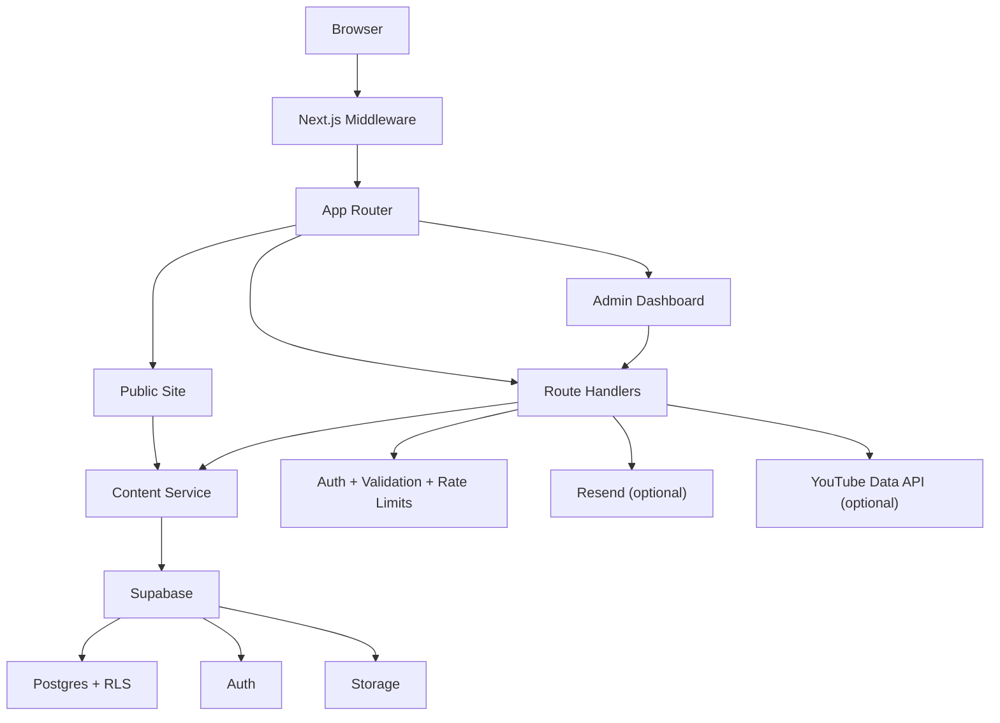

# VFuture

Private, proprietary CMS and community platform for a Free Fire-focused audience, built with Next.js 14, TypeScript, Tailwind CSS, and Supabase.

> This repository is not open source. Access and use are limited to authorized personnel and approved partners of Veltrix Media Group. See [LICENSE](LICENSE).

## Overview

VFuture combines a public-facing fan/community website with a protected admin control plane. The public experience includes event timelines, news, eSports stream surfaces, gallery content, contact channels, policy pages, SEO metadata, and localized route aliases. The admin experience provides content management, role management, invitation-based onboarding, activity visibility, site settings management, and media upload support.

The codebase is organized around the Next.js App Router and a shared content service layer that reads from Supabase when available and falls back safely for selected read paths during local or degraded scenarios.

## Core capabilities

- Public content pages for home, events, calendar, news, contact, privacy policy, and terms of use
- Parallel English and Vietnamese aliases for major public routes such as `/news` and `/tin-tuc`
- Protected admin area for events, news, streams, gallery, users, logs, active admins, and settings
- Invitation-gated admin registration flow with Supabase Auth and optional email delivery
- Role-based access control with `editor`, `admin`, and `senior_admin`
- Rich text news authoring with Tiptap, category management, and slug generation
- Gallery upload flow backed by Supabase Storage
- Stream scheduling with optional YouTube API-assisted status synchronization
- Contact submission endpoint with rate limiting and optional Resend delivery
- Security headers, request throttling, input sanitization, activity logging, and Supabase RLS policies

## Architecture at a glance



## Technology stack

| Layer | Details |
| --- | --- |
| Framework | Next.js 14 App Router, React 18 |
| Language | TypeScript with strict mode |
| Styling | Tailwind CSS, shadcn/ui, Base UI, custom design tokens |
| State and data | TanStack Query, Zustand, server data loaders |
| Backend | Next.js route handlers, Supabase SSR, Supabase service-role admin access |
| Database | Supabase Postgres with SQL schema and RLS policies |
| Auth | Supabase Auth, email/password login, optional Google OAuth |
| Content editing | Tiptap rich text editor |
| Media | Supabase Storage uploads, ImageKit-hosted brand assets |
| Email | Supabase Auth invite emails and optional Resend-backed contact delivery |
| Motion and UX | Framer Motion, Sonner, Lottie |

## Repository layout

```text
.
|-- public/                  # Static assets and service worker
|-- scripts/                 # Build and admin bootstrap scripts
|-- src/
|   |-- app/                 # App Router pages, layouts, metadata, API routes
|   |-- components/          # UI, layout, admin, public feature components
|   |-- hooks/               # React Query hooks
|   |-- lib/
|   |   |-- constants/       # Site config, flags, mock data
|   |   |-- data/            # Shared content service layer
|   |   |-- server/          # Auth, guards, rate limits, logging, stream helpers
|   |   |-- supabase/        # Browser/server/admin Supabase clients
|   |   |-- types/           # Domain and database types
|   |   |-- utils/           # Formatting, site settings, Vietnam time utilities
|   |   `-- validators/      # Zod schemas
|   |-- store/               # Small client stores
|   `-- types/               # Ambient type declarations
|-- supabase/
|   |-- schema.sql           # Database schema, triggers, policies
|   `-- seed-data.sql        # Optional sample seed content
|-- README.md
|-- CONTRIBUTING.md
`-- LICENSE
```

## Getting started

### Prerequisites

- Node.js 20 LTS or newer
- npm 10 or newer
- A Supabase project with Auth, Database, and Storage enabled
- A public `gallery` storage bucket in Supabase if you want media uploads from the admin UI
- A Resend account if you want outbound contact emails
- A YouTube Data API key if you want higher-accuracy stream status detection
- A VAPID public key if you want the browser push subscription UI to be visible

### 1. Install dependencies

```bash
npm install
```

### 2. Configure environment variables

Copy `.env.example` to `.env.local`, then fill in the values for your environment.

Only the variables listed below are currently read by application code:

| Variable | Required | Purpose |
| --- | --- | --- |
| `NEXT_PUBLIC_SUPABASE_URL` | Yes | Supabase project URL for browser/server SSR clients |
| `NEXT_PUBLIC_SUPABASE_ANON_KEY` | Yes | Public Supabase anon key |
| `SUPABASE_SERVICE_ROLE_KEY` | Yes for full admin workflows | Required for admin data operations, user management, and invite email integration |
| `NEXT_PUBLIC_SITE_URL` | Yes | Canonical site origin used for metadata and auth callbacks |
| `RESEND_API_KEY` | Optional | Enables Resend email delivery for contact submissions |
| `ADMIN_INVITE_FROM_EMAIL` | Optional but recommended with Resend | Sender identity for Resend-backed contact emails |
| `SUPABASE_QUERY_TIMEOUT_MS` | Optional | Read timeout before the content service falls back |
| `DISABLE_SUPABASE_RUNTIME` | Optional | Forces selected fallback behavior; not suitable for real admin authentication |
| `YOUTUBE_API_KEY` | Optional | Improves stream status detection accuracy |
| `NEXT_PUBLIC_VAPID_PUBLIC_KEY` | Optional | Enables the browser push subscribe button |

Notes:

- The current `.env.example` includes `ADMIN_INVITE_REPLY_TO_EMAIL`, but the application does not read that variable at runtime.
- `NEXT_PUBLIC_VAPID_PUBLIC_KEY` only enables client-side subscription capture. Durable push delivery is not implemented in this repository.

### 3. Provision Supabase

1. Create a Supabase project.
2. Run [`supabase/schema.sql`](supabase/schema.sql) in the Supabase SQL editor.
3. Optionally run [`supabase/seed-data.sql`](supabase/seed-data.sql) if you want sample content.
4. Create a public storage bucket named `gallery` if you want admin uploads to work out of the box.
5. In Supabase Auth, configure:
   - email/password auth
   - Google OAuth if your team uses Google sign-in
   - invite email template and mail delivery settings if you want invitation emails to be sent by Supabase
   - redirect URLs for local and production environments, including the `/auth/callback` route

Important implementation note:

- The bundled schema contains project-specific bootstrap assumptions for an owner account and should be reviewed before deploying into a fresh organization or tenant.

### 4. Bootstrap an admin account

The quickest repeatable path is the provided script:

```bash
npm run supabase:ensure-admin -- owner@example.com StrongPassword123 admin
```

The script will:

- create or update the Supabase Auth user
- mark the email as confirmed
- upsert the matching record in `public.users`
- set the initial `social.email` setting

Supported roles are `editor` and `admin`. The wider application also recognizes `senior_admin`.

### 5. Run the application

```bash
npm run dev
```

Useful entry points:

- Public site: `http://localhost:3000`
- Admin login: `http://localhost:3000/auth/login`
- Admin dashboard: `http://localhost:3000/admin`

## Available scripts

| Command | Purpose |
| --- | --- |
| `npm run dev` | Start the local Next.js development server |
| `npm run build` | Build for production and ensure a build ID exists |
| `npm run clean:build` | Remove `.next` and rebuild from scratch |
| `npm run start` | Start the production server after a build |
| `npm run lint` | Run Next.js ESLint checks |
| `npm run typecheck` | Run TypeScript in no-emit mode |
| `npm run supabase:ensure-admin -- <email> <password> [admin|editor]` | Create or update an admin-capable Supabase user |

## Data model and content flow

### Primary tables

- `public.users`
- `public.events`
- `public.news`
- `public.gallery`
- `public.settings`
- `public.admin_activity_logs`

### Settings-backed JSON modules

Not every domain object has its own table. Two notable modules are stored as settings values:

- `security.invited_emails` for pending admin invitations
- `esports.streams` for stream definitions

This is important when changing schemas, writing migrations, or building tooling around the project.

## Security model

- Middleware protects `/admin` and `/api/admin` routes with Supabase session checks
- Route handlers layer rate limiting and role-aware authorization on top of middleware
- Zod validates incoming request payloads
- `sanitize-html` strips or constrains user-provided content before persistence
- `next.config.mjs` applies CSP, HSTS, frame, referrer, and permissions headers
- Supabase Row Level Security policies enforce data access at the database layer
- Admin activity is captured in `admin_activity_logs`
- Login abuse protection escalates from warning to temporary ban logic

## Operational notes

- Public content pages are statically revalidated in several places with `revalidate = 60`.
- The eSports page is dynamic and client-refreshes stream data every 30 seconds, with status sync attempts every 60 seconds.
- The content service can fall back to in-memory mock/demo data for selected read paths when Supabase is unavailable or explicitly disabled.
- Real admin authentication still requires a working Supabase configuration.
- Login-attempt persistence uses Supabase if a compatible `login_attempts` table exists; otherwise the code falls back to in-memory tracking.
- Push subscriptions are stored in memory only in the current implementation.

## Deployment checklist

Before deploying, make sure you have:

- configured all required environment variables in the target host
- applied [`supabase/schema.sql`](supabase/schema.sql)
- created the `gallery` storage bucket if admin uploads are needed
- configured Supabase Auth redirect URLs for your deployed origin
- set `NEXT_PUBLIC_SITE_URL` to the final HTTPS origin
- reviewed project-specific bootstrap rules in the schema

Deployment-specific notes are documented in the supplemental guides below.

## Supplemental documentation

- [DEPLOYMENT_SETUP.md](DEPLOYMENT_SETUP.md)
- [QUICK_START_DEPLOYMENT.md](QUICK_START_DEPLOYMENT.md)
- [GITHUB_VERCEL_COMPLETE_GUIDE.md](GITHUB_VERCEL_COMPLETE_GUIDE.md)
- [GITHUB_VERCEL_DEPLOYMENT_GUIDE.md](GITHUB_VERCEL_DEPLOYMENT_GUIDE.md)
- [QUICK_REFERENCE.md](QUICK_REFERENCE.md)
- [SECURITY_AUDIT.md](SECURITY_AUDIT.md)

## Contributing

See [CONTRIBUTING.md](CONTRIBUTING.md) for contribution workflow, quality gates, and security expectations.

## License

VFuture is proprietary software owned by Veltrix Media Group. See [LICENSE](LICENSE) for the full license terms.
